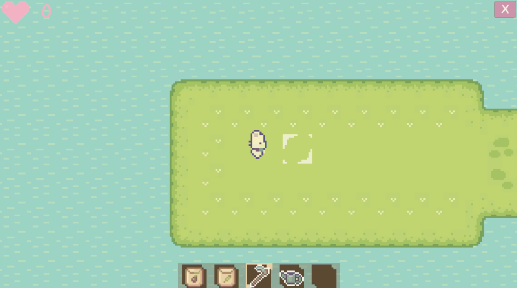
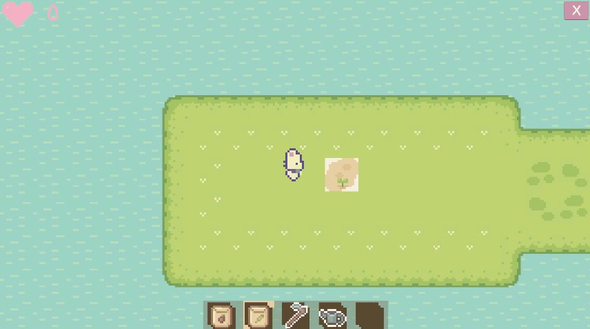
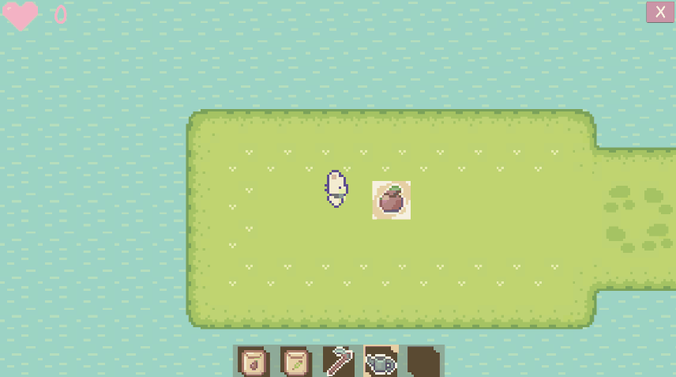

  

 
 
 

 Farming sim implemented in Unity.
 
 Art using [Sprout Lands Art Pack](https://cupnooble.itch.io/sprout-lands-asset-pack) & Aseprite
 
 ## Prep the Ground With Your Trusty Hoe
 
 
 ## Plant Various Plants Then Watch Them Grow Through Their Different Phases
 
 
 ## Use the Watering Tool to Make the Plants Grow Faster
 
 
 ## Harvest the Fruits of Your Labor
 
